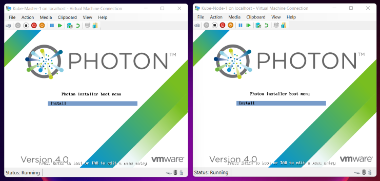
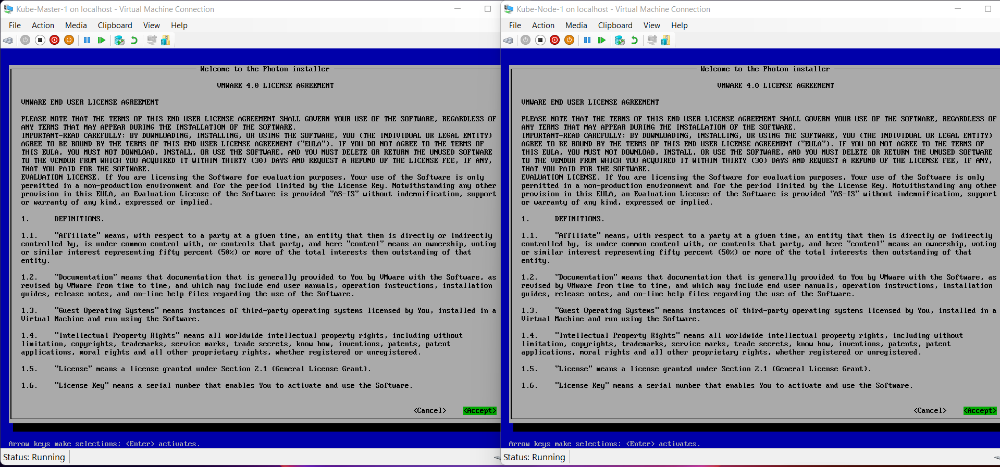
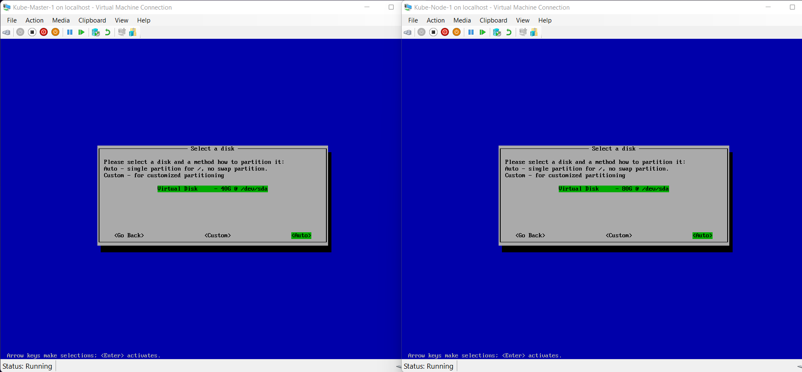
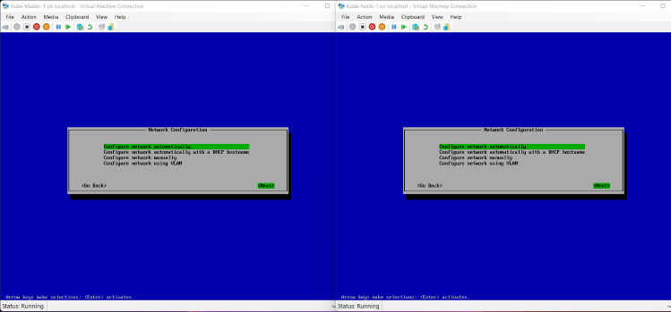
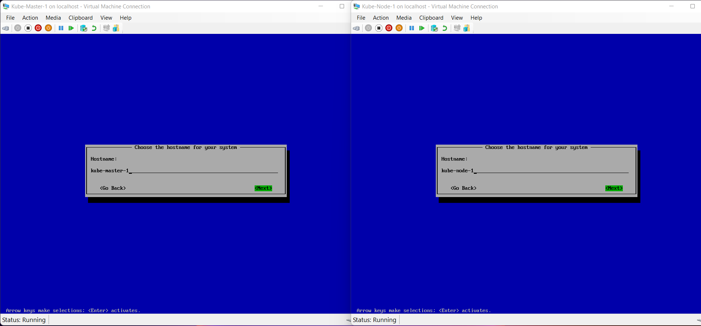
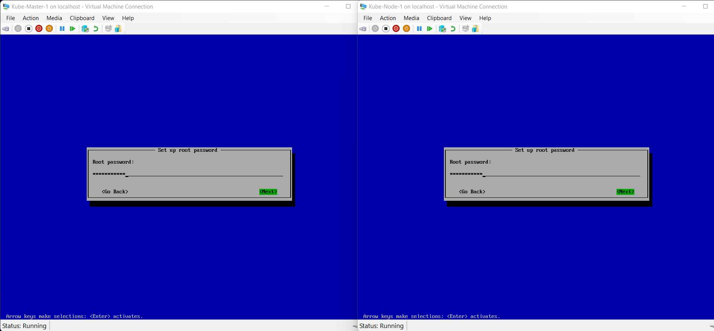
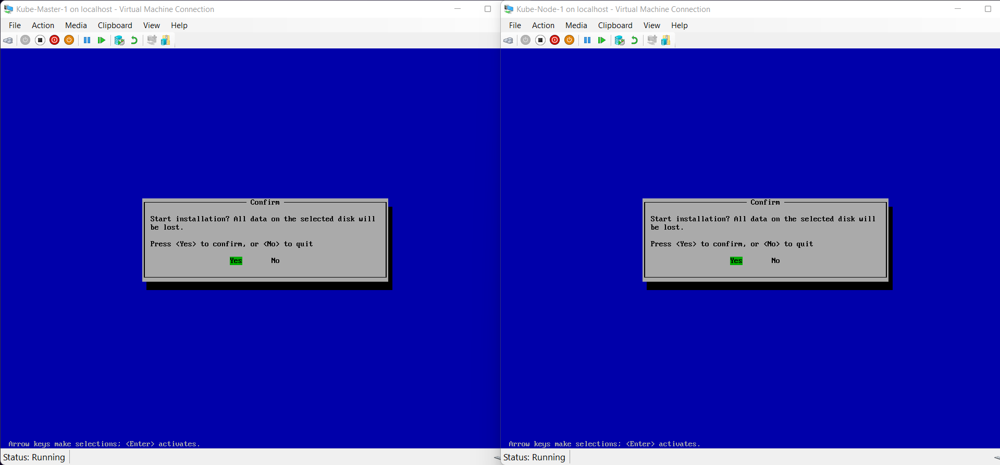
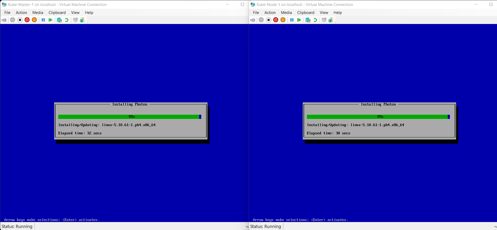
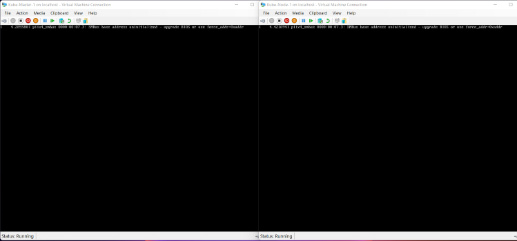
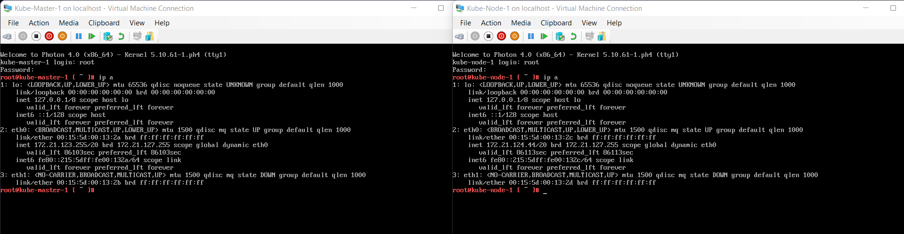

# K8s Cluster on PhotonOS (Hyper-V Instructions)
If you have Windows 10/11 Hyper-V, and want to experience Kubernetes cluster without using standalone clusters (_Minikube_,  _K3s_,  _MicroK8s_), then follow this guide. If you want to experience standalone clusters, then please refer below URLs.
1. Minikube (https://github.com/kubernetes/minikube/)
2. K3s (https://k3s.io/)
3. MicroK8s (https://microk8s.io/)
  
## Enable Hyper-V using PowerShell on Windows 10/11 Pro/Enterprise
Open a PowerShell console as Administrator. Run the following command:

```
Set-ExecutionPolicy -ExecutionPolicy Unrestricted -Force
Enable-WindowsOptionalFeature -Online -FeatureName Microsoft-Hyper-V -All
```

If the command couldn't be found, make sure you're running PowerShell as Administrator.
When the installation has completed, reboot.
 
## Setup Hyper-V Internal Switch and assign IP
On the Windows desktop, click the Start button and type any part of the name Windows PowerShell.
Right-click Windows PowerShell and select Run as Administrator.

To create an internal switch, run the following command.

```
New-VMSwitch -name K8sInternalSwitch -SwitchType Internal
```

To assign an IP, run the following command.

```
New-NetIPAddress -InterfaceAlias 'vEthernet (K8sInternalSwitch)' -IPAddress 10.0.0.1 -PrefixLength 16
```

## Create PhotonOS VMs (kube-master and kube-node)
To download PhotonOS, use the following link.
https://packages.vmware.com/photon/4.0/Rev1/iso/photon-minimal-4.0-ca7c9e933.iso

Move the `iso` file to a known location. The path `C:\Media-Files\photon-minimal-4.0-ca7c9e933.iso` has been assumed for the commands below.

To create Kube-Master VM, run following command.

```
Set-ExecutionPolicy -ExecutionPolicy Unrestricted -Force
# Master-1 Creation
New-VM -Name Kube-Master-1 -MemoryStartupBytes 2GB -BootDevice VHD -NewVHDPath 'C:\Users\Public\Documents\Hyper-V\Virtual hard disks\Kube-Master-1.vhdx' -NewVHDSizeBytes 40GB -Generation 1 -Switch 'Default Switch'
Set-VMProcessor -VMName Kube-Master-1 -Count 2
Add-VMNetworkAdapter -VMName Kube-Master-1 -Name 'K8sInternalSwitch'
Add-VMDvdDrive -VMName Kube-Master-1 -Path 'C:\Media-Files\photon-minimal-4.0-ca7c9e933.iso'

# Node-1 Creation
New-VM -Name Kube-Node-1 -MemoryStartupBytes 4GB -BootDevice VHD -NewVHDPath 'C:\Users\Public\Documents\Hyper-V\Virtual hard disks\Kube-Node-1.vhdx' -NewVHDSizeBytes 80GB -Generation 1 -Switch 'Default Switch'
Set-VMProcessor -VMName Kube-Node-1 -Count 2
Add-VMNetworkAdapter -VMName Kube-Node-1 -Name 'K8sInternalSwitch'
Add-VMDvdDrive -VMName Kube-Node-1 -Path 'C:\Media-Files\photon-minimal-4.0-ca7c9e933.iso'

# Start and Conect to VMs
Start-VM -Name Kube-Master-1
Start-VM -Name Kube-Node-1
vmconnect localhost Kube-Master-1
vmconnect localhost Kube-Node-1
```

To install PhotonOS on these VMs follow below step-by-step instructions. The instructions shown below were applied to both the VMs in parallel.
If PhotonOS team release Hyper-V compatible VHD, the instructions below can be reduced.


**Install**



**Accept**

 

**Auto**

 

**Next**

 

**Host Name (Same as VM Name)**

 

**Password**

 

**Confirm Password**

 

**Yes**

 

**Wait 40 seconds**

 

**Press any key**

 

**Wait 2-5 minutes**

 

**Login as 'root' User**
**Get the IP Address to connect using ssh Client. Next set of scripts can easily be used to reduce the typing**

 


